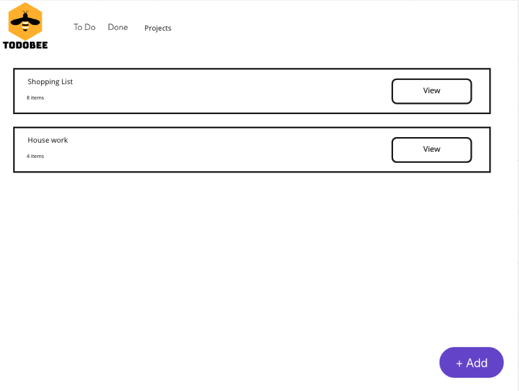
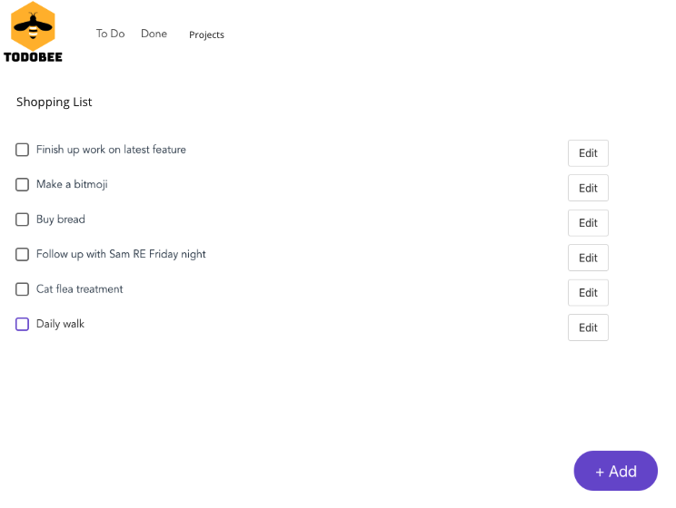

# Candidate Instructions

## Overview

Welcome! This challenge is designed to test your Full Stack developer skills.

The whole challenge should be achievable in 2 hours or less. If your experience is significantly different, please let us know so we can further tune this challenge or instructions.

Please procede through the tasks in order. Once completed, follow the steps to prepare this for submission.

## Scenario overview

ToDoBee is a popular To Do app that users can download and run themselves. We've been in the market for about 6 months and have been getting feedback from users around what they want more of and the troubles they are having.

We're looking to you to help get through some of it.

Our tech stack on the frontend is:

1. Vue.JS 2
1. Buefy for Bulma based Vue components
1. TypeScript as the primary language

Our tech stack on the backend is:

1. C# and .NET 5
1. HotChocolate, a .NET GraphQL framework
1. Entity Framework for DB access

## Getting set up

## GIT

Note that this package will not have been provided to you in a GIT repository.

You should initialize one (`git init`) and commit the current state of files.

The submission step will require you to zip up your final state of the code, without any git details, which can be achieved with the `git archive` command. Be aware this will only work from your latest commit, so it is recommended you commit often.

## IDE

To ease the development process, we highly recommend you undertake this challenge in [VS Code](https://code.visualstudio.com/Download).

After you have opened the codebase there, you should install all recommended extensions (if you don't receive a pop up, go to the extensions sidebar).

### Setting up the web app

For the web app (in the `app` folder) you will need:

1. [Node version 12](https://nodejs.org/en/download/) or higher
1. yarn >= 1.22 installed (`npm install -g yarn`)

After they are installed, run:

```bash
cd app && yarn
```

To launch the web app locally, run (from the `app` folder):

```bash
yarn serve
```

### Setting up the API

For the API (in the `service` folder) it is preferred that you install [.NET 5.0 SDK](https://dotnet.microsoft.com/download/dotnet/5.0) or higher. Make sure to use links in the 'Build apps - SDK' column.

To launch the API, you can start running (and debugging) through VS Code's 'Run' sidebar. Alternatively, you can run with

```base
cd service/ToDoApi && dotnet watch run
```

## Task 1 - 15 minutes

This is a frontend focused task.

Users have raised that the To Do List does not work well on mobile browsers, and the edit button is actually missing!

Complete this task by:

1. Making sure the edit button shows even when in mobile
1. Make any other changes to enhance the layout of the to do element for mobile view

## Task 2 - 15 minutes

This is a backend focused task.

Users want to be able to clear up older To Do Items that are no longer relevant to them. To achieve this, we'll need to implement a DeleteToDoItem operation.

Following the pattern of implementation for UpdateToDoItem (in service/ToDoApi/ToDoItems/ToDoItemMutations.cs), complete this task by:

1. Creating a DeleteToDoItem mutation
2. Confirming the new mutation works

## Task 3 - 30 minutes

For this task, you will not be writing any code.
We're looking at implementing a new feature so that users can group their To Do's into Projects.

Primarily, this will be implemented as two screens:

Project page:



And Projects task list:



Please create a new markdown file `Project Tickets.md` and detail all the tickets needed to achieve this feature across both frontend and backend.

List any assumptions at the top of the file.

Example format for a feature for adding sorting of to do items:

```markdown
# Project Tickets

## Assumptions

1. Users only want to order by dates

## Ticket - Add an Order button to the Items List page
Allow the user to toggle through different ordering strategies.

Acceptance criteria:
1. Default will be latest first
1. Second option will be oldest first
1. On toggling the option, the query will be re-ran with the API specifying the newest sort order.
1. The loading spinner should be shown while the API interaction is taking place
```

## Task 4 - 1 hour

In this task, you will be adding a new feature to the product.

Users have asked to be able to prioritise items into High, Normal, or Low priority.

To complete this task, you'll need to:

1. Add an additional field to the ToDoItem model, and add a migration (instructions in service/ToDoApi/README.md)
1. Expose this field to the CreateToDoItemInput and UpdateToDoItemInput classes
1. Add this field to [the AddNew component](app/src/views/AddNew.vue) to allow setting it on creation of a new ToDoItem
1. Add this field to [the Edit component](app/src/views/Edit.vue) to allow updating it for an existing ToDoItem
1. Change the order by query in [the ToDoItems component](app/src/components/ToDoItemsList.vue) to order by priority before date
1. Add an Icon/Image/Indicator to [the ToDoCard component](app/src/components/ToDoCard.vue) to indicate High or Low priority (no indicator for Normal)

*stretch goal* Any further items you feel are lacking for the implementation of these tasks. Please add comments where any further work was done.

## Preparing for submission

To submit your challenge, please follow these steps:

1. Be sure to have committed all your changes to your local git repository
2. Execute `git archive --format zip -o tech-challenge-YOUR_NAME.zip HEAD`
3. Email the generated zip file back to your contact person
